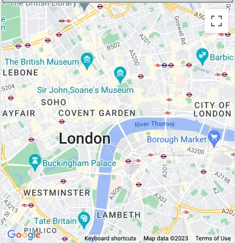
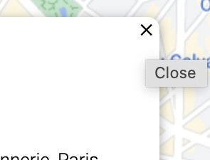

# Choose Your Holiday Destination

Choose your holiday destination is a user-friendly website where you can easily search for any place in the world and you can check hotels in a given place as well as restaurants and tourist attractions.

The site uses google places search and through radio buttons you can choose between various options to search for places of interest on the map. The search results will be displayed in a table under the map on mobile devices, or next to the map on larger screens. In addition, markers are displayed on the map next to each searched place, which you can click on and find out details about the searched place, such as: address, telephone number and website.

After finding the place of interest, the search results and the name of the found place can be deleted using the Clear button.

The website is fully responsive and was designed using HTML, CSS and JavaScript.

[View the live site](https://monimaj89.github.io/Project2/)

# Contents

* [User Experience (UX)](#user-experience-ux)
  * [Project Goals](#project-goals)
    * [User Goals](#user-goals)
    * [Site Owner Goals](#site-owner-goals)
    * [User Expectactions](#user-expectactions)
  * [User Stories](#user-stories) 
    * [As a first time user](#as-a-first-time-user)
    * [As a site owner](#as-a-site-owner)
* [Design](#design)
  * [Colour](#colour)
  * [Typography](#typography)
  * [Icons and Images](#icons-and-images)
  * [Wireframes](#wireframes)
* [Features](#features)
  * [Favicon](#favicon)
  * [Search Bar](#search-bar)
  * [Clear Button](#clear-button)
  * [Radio Buttons](#radio-buttons)
  * [Map](#map)
  * [Markers](#markers-on-the-map)
  * [Table](#table)
  * [Footer](#footer)
  * [404 page](#404-page)
* [Technologies](#technologies-used)
* [Testing](#testing)
  * [Validator Testing](#validator-testing)
    * [HTML](#html)
    * [CSS](#css)
    * [JavaScript](#javascript)
  * [Wave Testing](#wave-testing)
  * [Lighthouse Testing](#lighthouse-testing)
  * [User Testing](#user-testing)
* [Bugs](#bugs)
* [Deployment](#deployment)
* [Credits](#credits)
* [Git commits messages](#git-commits)

# User Experience (UX)
## Project Goals
### User Goals:
* Find a desirable place on the map
* Search for hotels, resturations and tourist attractions
* Find the address, phone number and website of each facility and its star rating

### Site Owner Goals:
* Allow user to easy search on map
* Provide essential information in the table
* Allow user to clear all results before new one

### User Expectactions
* An easy and intuitive navigation system
* An easy access to any information
* Buttons that work as expected
* Accessible page regardless of screen size
* A simple search box
* Clear all results with one button

## User Stories

### As a first time user:
* I want to know the purpose of the website
* I want to easily navigate throughout the website
* I want to be able view the website on mobile device
 
### As a site owner:
* I want users to search places on the map
* I want search results be displayed in the table
* I want users to search type of place using radio buttons
* I want users to have easy access to detailed information about the searched place

# Design
## Colour

The colour of the page is maintained in shades of grey with light blue details. The background colour of the page is #ced8d9. Light blue #0ba5f1 was used in details like search bar icon, clear button and radio buttons. White colour #fff was used for search box background and table row.

## Typography
Font was imported from [Google Fonts](https://fonts.google.com/). 

* 'Montserrat font is used through the page. It is a simple and elegant font which match the site.

* Sans serif is set as a backup if any of the fonts fail to load.

## Icons and Images
1. Icons were sourced from [FontAwesome](https://fontawesome.com/). 

* The search icon was selected to be easily understable and accessible for every user.

2. Image
* Header image was made by myself using [GIMP](https://www.gimp.org/).
* Wave effect on the image was made using [ShapeDivider](https://www.shapedivider.app/)
* Background image was borrowed from [Asad Photo Maldives](https://www.pexels.com/photo/photo-of-coconut-trees-on-seashore-1591373/)

## Wireframes
Wireframes were created at the beginning of the design process using [Balsamiq](https://balsamiq.com/wireframes/desktop/). 

* Desktop

* Tablet

* Mobile phone

# Features 
## Favicon
* Palm tree from [Favicon](https://favicon.io/) 
* Make the tab stands out among others and allow users easily revisit the page

  

## Search bar
* Was downloaded from [CodingNepalWeb](https://www.codingnepalweb.com/)
and adjusted to my needs
* Connected to google map with autocomplete feature
* Is responsive and shrinks or expands depends of screen size

## Clear button
* Deletes all search results and search bar content
* Was styled to match the overall page shape

## Radio buttons
* To let users search between 
  * hotels 
  * restaurants 
  * tourist attractions
* Styled to match the rest of the page

 
* For more narrow screen, like in Samsung Fold, radio buttons are placed in a column

## Map
* Was downloaded from [Google Maps Platform](https://developers.google.com/maps/documentation/javascript/examples/places-autocomplete-hotelsearch) and adjusted to my needs
* Is responsive and adapts to the size of the screen 

## Markers on the map
* Animated markers drop on the map with the searched places
* Each marker contains detailed information about place
* Markers are taged with letter A-Z

## Table
* Scrollable table displays the searching results
* Contains ID marker, name of the place and star rating
* May be clicked and it displays that place on the map

## Footer
* Contains copyright symbol, my name and year when the page was created

## 404 page
* Animated 404 page borrowed from [codewithrandom](https://www.codewithrandom.com/2022/12/19/simple-404-page-html-code-404-page-html-codewithrandom/) and adjust to my needs

# Technologies used
  * Languages
    * The structure of website was developed using HTML as the main language
    * The Website was styled using custom CSS in an external file
    * The interactive part of the site was created with JavaScript
  * Tools
    * GitHub - source code is hosted and deployed using Git Pages.
    * Git - used to commit and push code during the development off the Website
    * Google Chrome Developer Tools was used for debugging and testing with Lighthouse
    * [Google Maps API](https://mapsplatform.google.com/maps-products/) - to download and set the map on the site
    * [Google Places API](https://mapsplatform.google.com/maps-products/#places-section) - connected to search bar and used to display locations on the map
    * [Google Fonts](https://fonts.google.com/) - used to import fonts for use in the site
    * [Font Awesome](https://fontawesome.com/) - used for icons
    * [Cloud Convert](https://cloudconvert.com/) - used to convert images into webp
    * [Tinyjpg](https://tinypng.com/) was used to reduce the size of the image
    * [Favicon](https://favicon.io/) - used for a browser tab icon
    * [Balsamiq](https://balsamiq.com/wireframes/desktop/) - used to create wireframes
    * [Mockup Generator](https://techsini.com/multi-mockup/) - used to create mockup image

# Testing
## Validator Testing
### HTML
* The page were tested using the [W3C Validator](https://validator.w3.org/)
* There was one [warning](assets/images/html-warning.webp)
It was fixed by changing section element to div element.
  * [HTML](assets/images/html-check.webp)

### CSS
* [CSS Validator](https://jigsaw.w3.org/css-validator/) were used to test the CSS, and shows no errors.
  * [CSS Check](assets/images/css.webp)

### JavaScript 
* [JSHint](https://jshint.com/) were used to test the JavaScript, and shows no errors
* There are two unused variables which are functions connected with index.html code, I've tried changed it for event listener instead of onClick, but I was not able to make it work
* Undefined variables 'google' are from code copied from [Google Maps Platform](https://developers.google.com/maps/documentation/javascript/examples/places-autocomplete-hotelsearch)
  * [JS Check](assets/images/jscheck.webp)

## Wave Testing
* The page was run through the Web Accessibility Evaluation Tool [Wave](https://wave.webaim.org/), the initial report showed a few needs for improvement:
  * No heading structure, which in this page I believe is not necessary
  * Changed colour of Clear button text from white to black to improve contrast
  * Screen reader only information  were added for search bar icons.
* There were still few alert errors:
  * Very small text on google map
  * Redundant title text which I didn't find solution
  * Layout table which I also wasn't able to solve

* 

## Lighthouse Testing
### Lighthouse testing was performed using [Google Chrome Lighthouse](https://chrome.google.com/webstore/detail/lighthouse/blipmdconlkpinefehnmjammfjpmpbjk) extension.
* [Mobile](assets/images/mobilelight.webp)

  * The performance on mobile devices is not exactly what I wish for, this is due to the image being too big, the image has been passed through [Tinyjpg](https://tinypng.com/) a few times but still seems to be to big.
* [Desktop](assets/images/desktoplight.webp)

  * On desktop on the other hand there is a tiny problem with the best practice which is caused again because of the image. The aspect ratio isn't quite perfect but it was necessary to keep the image to keep the image at a suitable size for a large screen

## User Testing
Thorough and extensive testing has been carried out on the site. Each section of the site has been thoroughly checked to ensure its trouble-free operation and to correct any errors. The site was built with a mobile first approach and the page layout adjusted to fit larger screens without unnecessary scrolling. The page layout test was carried out on all screen sizes from mobile devices through tablets and laptops to desktops. Additionaly the page layout has been adapted to a narrow screen, such as Samsung Fold, by shrinking the search bar to minimum and placing radio buttons in the column.
|   Target      |   Outcome     | Image |
| ------------- |-------------| -----------|
| 1. Loading the map  | Open the page and ensure the map loads, same difficulties arosa before with the API key and the Google Cloud biling account which caused the map not bing displayed |  |
| 2. Viewing and scrolling |Browse the map by grabbing and dragging it with mouse. Scroll around the map, zooming in on the streets | |
| 3. Formatting the map size | By default, the map size is set to 100% on the mobile screen size. On the bigger screens media query has been set to display map to the left site of the page, making space for the result table on the right. On mobile devices table result is displayed below the map | |
| 4. Expand the search bar  | Click on the magnifying glass icon to expand the search bar |  |
| 5. Search locations using search bar |Search box returns a pick list and predicted search terms | |
| 6. Use radio buttons | Click on radio options to choose between hotels, restaurants and attractions dislpayed on the map | |
| 7. Check the info details about place |Click on the markers on the map to check address, telephone number or website of each place searched| |
| 8. Close the information window| Click the cross in info window to close it and pass to another marker, checking if the displayed details are correct for both|  |
| 9. Change markers area | Markers appear on default map location, drag the map using mouse and click again on radio buttons to display hotels, restaurant and attractions in the different part of the city, old markers are cleared||
| 10. Display search result in the table | All places search by the user are displayed in the table with id tag, name and rating stars. Scroll table to see more results ||
| 11. Display place on the map by choosing it from the table | Click the place name in the table to display it on the map ||
| 12. Clear the search result | Click on the clear button to delete all searching results, with markers, table and search bar. Reload the page for default checked hotel radio option ||
| 13. Hide the paragraph above the search bar on mobile devices | Click on search bar icon to hide the paragraph above to save some space on smaller devices ||
|14. Shrink the search bar | Click on the cross next to the search icon to shrink the search box ||

# Bugs
* Radio button for hotels is coded as checked, but when clicking clear button it will also get cleared. For temporary solution reload the page to restore the checked function.

* Search function works only when choosing from the list, search icon works only to expand the bar, not for search results. 

# Deployment
### The following steps were taken to deploy the website on GitHub Pages:

1. The Code Insitute template was obtained from https://github.com/Code-Institute-Org/gitpod-full-template
2. A new repository was created in GitHub, the project was named.
3. The green Gitpod button was pressed to open a new workspace/development environment (obtain the gitpod extension to enable the green button).
4. Git is used to commit during development and push this over to Github
5. To create the hosted site at Github Pages, I navigated to the Github repo settings tab and found the Github pages dedicated section.
6. The main branch was chosen in the dropdown menu and the 'save' button was pressed. This supplied a live link to the [website](https://monimaj89.github.io/Project2/).

### To run locally
1. Go to the Github repo at https://github.com/monimaj89/Project2.
2. Click on the 'code' button and copy HTTPS link.
3. Open your own terminal in your editor and change the current working directory to the location of where you want the cloned directory to be.
4. In the terminal type git clone, and then paste the URL you copied.
5. Press enter to complete.

### You can fork the repository by following these steps:

1. Go to the GitHub repository
2. Click on Fork button in upper right hand corner

# Credits
* The following tutorials and articles have been used to help create my site
  * [W3 Schools Google Maps Event](https://www.w3schools.com/graphics/google_maps_events.asp) - map’s location on the site
  * [W3 School Event Listener](https://www.w3schools.com/js/js_htmldom_eventlistener.asp) - add event listener for hiding the paragraph
  * [Add a Google Map with the marker](https://developers.google.com/maps/documentation/javascript/adding-a-google-map) - add Google map to the site
  * [Google Maps Markers](https://developers.google.com/maps/documentation/javascript/markers) - add green markers to the map
  * [Marker Animations](https://developers.google.com/maps/documentation/javascript/examples/marker-animations-iteration) - add an animation to markers
  * [Info window](https://developers.google.com/maps/documentation/javascript/examples/infowindow-simple) - pop up window with info details
  * [Rating details](https://developers.google.com/maps/documentation/places/web-service/details#PlaceDetailsResults) - Rating star in the table
  * Google Places API Autocomplete
    * [Autocomplete feature](https://developers.google.com/maps/documentation/javascript/examples/places-autocomplete) - autocomplete list with predicted terms
    * [Search for hotels etc.](https://developers.google.com/maps/documentation/javascript/examples/places-autocomplete-hotelsearch) - search for hotels functions extended with restaurant and attractions
    * [Place search box](https://developers.google.com/maps/documentation/javascript/examples/places-searchbox) - search box conncected to the map
    * [Place deatils](https://developers.google.com/maps/documentation/javascript/examples/place-details) - info details about place in pop up window
  * [Java Script Google Maps API Tutorial](https://www.youtube.com/watch?v=uPhWSyRqQDA&t=0s&ab_channel=SamCodes) - additional help understanding Google Maps API

I would also like to thank 
1. Code Institute - for expanding my knowledge and well prepared courses
2. Gareth McGirr - my menthor, who was always very helpful
3. Slack community - Their help was invaluable.
4. [Stack Overflow](https://stackoverflow.com/) - they always had an answer to my question

# Git commits
After receiving the results of my project, I got some warnings about git commit messages, I know that at this stage I have no option to change them but I would like to document how these messages could look better
|   Old commit message      |   New message     |
| ------------- |-------------|
| 1. Add live site  | Create a link for a live site | 
| 2. Add radio buttons  | Add radio buttons connected to the map | 
| 3. Add markers and table results  | Add google map markers and table results | 
| 4. Add star rating to the table  | Create a star rating displayed in the table | 
| 5. Add info window content | Add an info window showing place detail on the map  | 
| 6. Add clear button  | Add button with clear search result function | 
| 7. Hide paragraph text on smaller devices  | Create a function to hide a paragraph on mobiles | 
| 8. Add design and features to readme  | Create a design and features section in README | 
| 9. Small amendments to code  | Refactor the code in index.html file | 
| 10. Small amendments to code  | Refactor the code in map.js file | 
| 11. Edit JS testing part  | Edit JS testing section in README | 
| 12. Adjust mockup image  | Adjust mockup image in README | 
| 13. Style a 404 page  | Add a color and hover effect of 404 page | 
| 14. Style a 404 page  | Style a whole 404 page in css file | 
| 15. Adjust 2404 page  | Adjust a style for 404 page in css file | 
| 16. Adjust 404 page and add media query  | Add a media query and change color to 404 page | 
| 17. Add content to readme | Create a content list in README | 
| 18. Fixed typos | Fix typos in README and index.html files | 
 